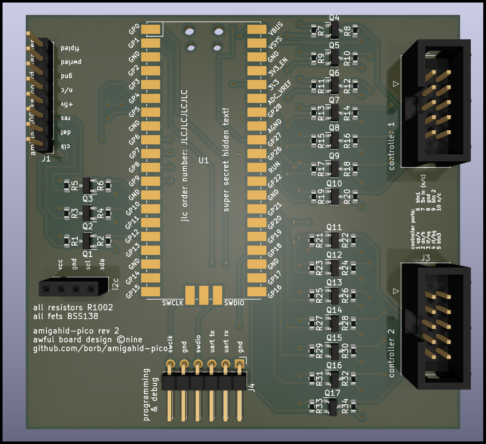

# amigahid-pico

## introduction

amigahid-pico is a rewrite of the [amigahid](https://github.com/borb/amigahid) project to the rp2040 microcontroller, the raspberry pi pico in the short term, possibly something more bespoke if the complete project goals are reached.

**this is a work in progress.** if it builds, that's useful.



## why?

amigahid was written for the avr and specifically, the max3421e usb host controller attached to the avr. the rp2040 combines an on-the-go usb controller with a dual-core cortex m0 cpu, and independant state machines for gpio; in effect, hid output events can be farmed off to a small routine and the processor can go back to processing other input from additional devices. this opens the possibility of handling many different hid devices concurrently (keyboard, mouse, game controller, etc.) without devoting significant time to converting the output signal to the destination hardware requirements.

## what is the latency of this?

no idea.

## configuration

open [CMakeLists.txt](/CMakeLists.txt) and look for the configuration options. comment and uncomment as needed.

## building the source code

prior to installation, ensure you have cmake, gnu make and gcc targetted to arm-none-eabi. you should be able to find these in debian. homebrew in macos has a cask for prebuilt gcc 10 binaries from arm. under windows, you're probably best off using wsl.

clone the repository. once cloned, you'll need to initialise the submodule for the pico sdk.

```shell
$ git submodule update --init --recursive
```

the tinyusb component of the pico-sdk has a lot of its own submodules so this could take some time.

when it's ready, start cmake off:

```shell
$ cmake -B build/ -S .
```

then build:

```shell
$ cd build && make
```

the resulting binaries will be in `build/src/` once built.

## installing on a pi pico (or similar) board

you have two options. swd or bootsel. swd will require usage of a raspberry pi (or pi pico with swd shim code installed), and you can flash the binary via openocd.

the easiest option is bootsel: take a powered down pico, hold the bootsel button and attach a micro usb cable. copy the `amigahid-pico.uf2` file from `build/src/` to the mounted usb storage volume. the pico will spontaneously disconnect, and when it comes back, it will be running the amigahid-pico code. disconnect usb and attach an otg adapter.

## how do i attach this to my amiga?

the board is designed to be mounted atop the amiga 500 keyboard header. mount a strip of eight 2.54mm pitch sockets with sufficient clearance from the nearby custom chips (cia, mostly). the drill holes are m3 - use some nylon supports to support the board and stop it flexing.

for other amigas, you will need to refer to your model's keyboard socket. instead of a socket on the underside, mount 2.54mm pitch idc pin strip to the top of the board and use dupont connections to attach to the amiga in your favoured manner. most amigas except for the a1000 (which uses an rj11 connector) use some form of din plug. the signalling is identical across the entire range.

the amiga 600 and 1200 have a surface mounted keyboard mcu; until a design has been put together, you can tap kclk and kdat from the chip (use an upturned plcc socket). find the pin information at [amigapcb.org](https://www.amigapcb.org/). please be **really** careful attaching to these machines.

the pcb has a key for signals; only kclk, kdat, power and ground are required. reset is not required for big-box amigas, which use clock to signal reset.

### amiga 500 keyboard header

all signals are active low.

| pin# | signal | meaning  | notes |
|------|--------|----------|-------|
| 1    | kclk   | clock    |       |
| 2    | kdat   | data     |       |
| 3    | /res   | reset    | issues a hard reset |
| 4    | +5v    | 5v power |       |
| 5    | nc     | nc       | not connected (often physically absent) |
| 6    | gnd    | ground   | though if powering arduino/avr from psu, may be able to use that ground line |
| 7    | pwr    | power    | provides power to keyboard power led to indicate amiga is on/audio filter status |
| 8    | drv    | drive    | indicates floppy drive activity |

7 and 8 are not connected to the pico in any way, so you may want to investigate another way of indicating floppy drive and power status.

## roadmap

* i2c display support
* runtime configuration as opposed to build flags (store in flash)
* revision 3 pcb with usb socket, 74-series bus transceiver, smaller footprint
* keyboard leds (currently not working and unknown reason why)
* watchdog timer
* pio statemachine handover to reduce dependance on cpu scheduling
* joystick emulation
  * cd32 pad emulation also
* amiga configuration preference panel
* more keymaps
* gotek control - either i2c slave device piggybacked off of the display connector, or simulation of rotary encoder pulses
* amiga reset warning
* mouse wheel codes to keyboard via newmouse keycodes
* status display via pico led

crazy talk:
* non-amiga support
* non-hidbp support
* analogue/paddle emulation
* fix some tinyusb issues (hotplug, timing-related instability)

done, former roadmap items:
* quadrature mouse emulation
* usb hub support

## errata

### board revision 1

revision 1 was based around using the txs0108 bidirectional level shifter, which proved to be a mistake: whilst it worked for keyboard functionality, the voltage drop once connected to a controller port was so significant the amiga was held in reset. this would not have been an issue for big-box amigas as they have no dedicated reset line on the keyboard port, but it would have proved difficult for the amiga 500, 600 and 1200.

### board revision 2

revision 2 of the board was the first successful test. this will change in the near future as some quirks were discovered during assembly. the design was changed to be mosfet-centric  using the bss138; this may change in future. i'd like to use the

the pico is attached using castellated edges to pads on the surface. ensure the alignment is straight and flood the edges with solder, ensuring the solder makes contact with both the edge and the pad (check). buzz the attachment out with a multimeter to ensure it's worked and not shorted.

for the amiga 500, the keyboard connector can use 2.54mm pitch sockets on the seven pin header and attach directly to the motherboard, though for simplicity of placement you may want to use short dupont wires for attachment.

the programming & debug header provides serial wire debug and uart connections. you can program either via swdio or the usb port & bootsel button.

the four pin i2c header is suitable for the generally available ssd1306 displays to mount directly to, assuming the pin layout is identical. the display is not currently used but will be used in future versions.

attach a usb otg adapter to the pico's usb port. usb hubs are supported, but only at a single level. multiple mice and keyboards can be attached and used concurrently, allowing you to attach a keyboard for desk and one for remote usage (e.g. sofa).

the controller ports mapping will change after revision 2: the assumption was made that 2x5 pin idc connectors were wired the same way as d-sub 9-pin connectors, and this was wrong. the numerical wiring works 1-2-3-4-5-6-7-8-9 vs 1-6-2-7-3-8-4-9-5, making ribbon attachment difficult in revision 2. this will be changed in revision 3.

## license

on the fence at the moment, but the current license choice is Eclipse Public License 2.0 (EPL-2.0).

## whuh... who?

nine <[nine@aphlor.org](mailto:nine@aphlor.org)>

