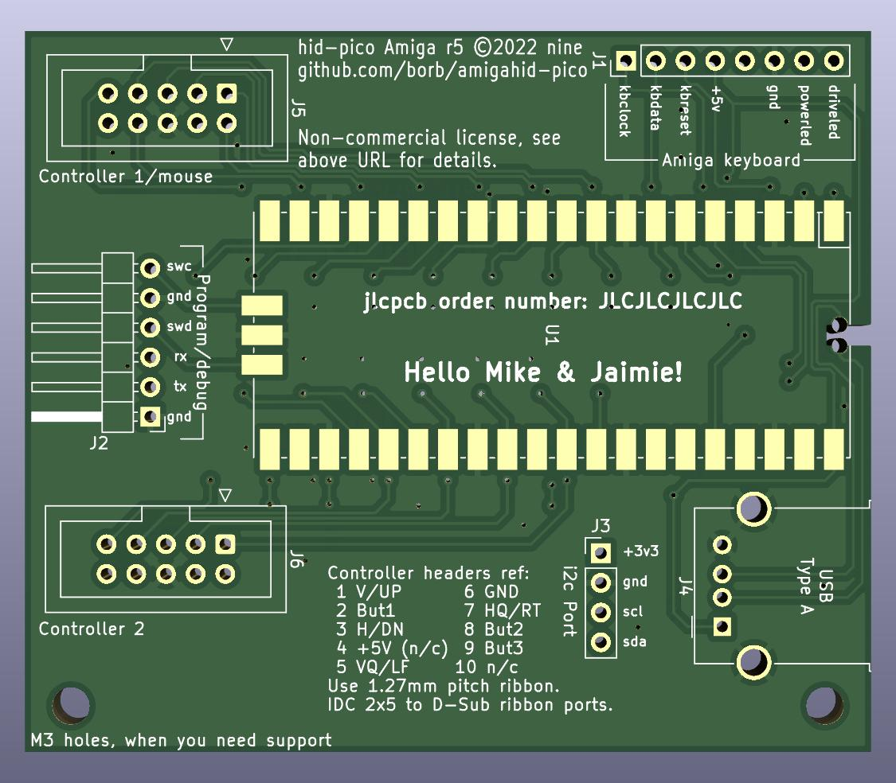

# amigahid-pico

## introduction

amigahid-pico uses the rp2040 microcontroller (e.g. the raspberry pi pico) in a carrier board to attach usb input devices to a standard amiga without the need for a usb stack on the amiga itself.

it currently supports keyboards and mice and provides connection via the internal keyboard connector, the rj11/din socket on big-box amigas, and via the controller ports.

**this project is very much a work in progress.**

## **important note**

* current kicad files are for r5 pcb, pin mappings are not yet in the source tree! i have not yet generated this board as a pcb, but it is mostly identical to r4. the keyboard and controller port 1 are correct at time of writing, and will be fixed for the second controller port when the next prototype arrives.

* **always read the [errata](./doc/errata.md) section for the current pcb layout before deciding whether or not to build.**

## documentation

* [installation](./doc/installation.md)
* [hardware](./doc/hardware.md)
* [errors in revisions (errata)](./doc/errata.md)

## history

this project is a rewrite of the [amigahid](https://github.com/borb/amigahid) project to the rp2040 microcontroller.

originally, after the retirement of the arduino adk board and shortening availability of the max3421e "usb host shield" for arduino boards, the need for a cheap, easy and continually available replacement was sought.

at first, the uhs mini via a level shifter seemed ideal, but significant issues were found convincing it to work with a variety of arduino boards.

the rp2040 made sense as a target because it is widely available, has sufficient physical connections and is powerful enough to meet multiple needs.

## what is the latency of this?

i have not measured the latency, but the keyboard signals are sent out the moment they are received on the usb bus. the potential latency is likely fractionally longer than the amiga mcu but bear in mind the rp2040 is significantly faster than the standard amiga keyboard controller.

## roadmap

please see the issues tab on the [github repository](https://github.com/borb/amigahid-pico) for the current list of planned features. the tl;dr is:

normal:
* i2c display for config/status
* controller emulation
    * keyboard-based controller emulation (use udlr for directions?)
* flash memory-based configuration
* possible amiga-side control panel (using bidirectional controller port signals)
* rotary control simulation (for controlling gotek drives)

crazy talk:
* non-amiga support
* non-hidbp support
* analogue/paddle emulation
* fix some tinyusb issues (hotplug, timing-related instability)

## license

on the fence at the moment, but the current license choice is Eclipse Public License 2.0 (EPL-2.0).

## third party licenses

* µgui: this code contains 'µgui' by achim döbler; the license for this can be read at in the [display readme](./src/display/README.md)

## whuh... who?

nine <[nine@aphlor.org](mailto:nine@aphlor.org)>
