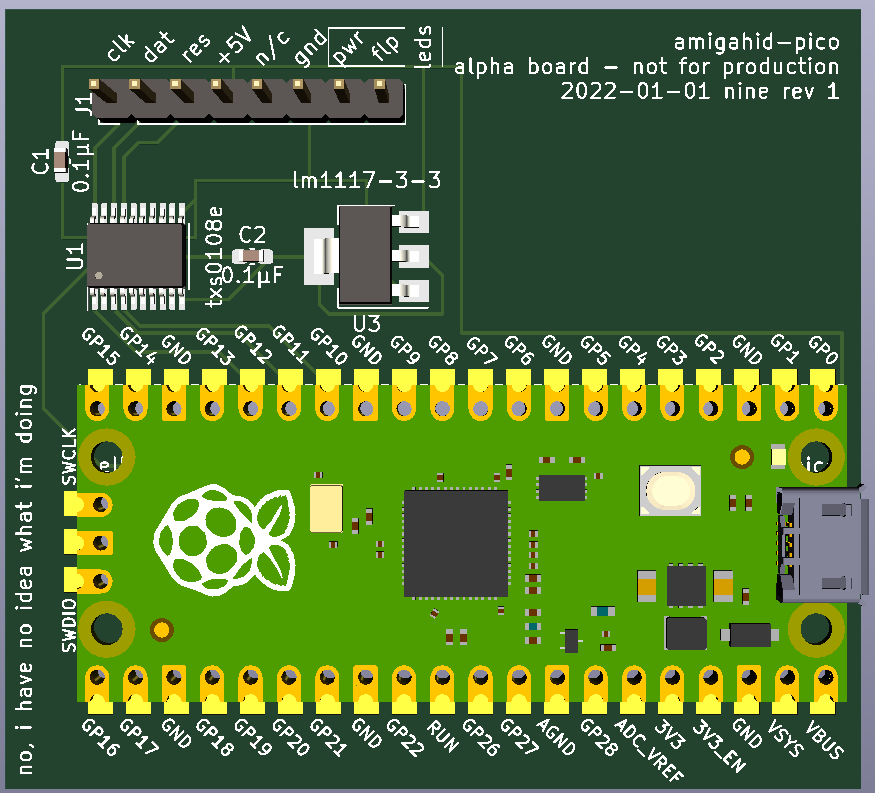

# amigahid-pico

## introduction

amigahid-pico is a rewrite of the [amigahid](https://github.com/borb/amigahid) project to the rp2040 microcontroller, the raspberry pi pico in the short term, possibly something more bespoke if the complete project goals are reached.

**this is a work in progress.** if it builds, that's useful.



## why?

amigahid was written for the avr and specifically, the max3421e usb host controller attached to the avr. the rp2040 combines an on-the-go usb controller with a dual-core cortex m0 cpu, and independant state machines for gpio; in effect, hid output events can be farmed off to a small routine and the processor can go back to processing other input from additional devices. this opens the possibility of handling many different hid devices concurrently (keyboard, mouse, game controller, etc.) without devoting significant time to converting the output signal to the destination hardware requirements.

## what is the latency of this?

no idea.

## building

prior to installation, ensure you have cmake, gnu make and gcc targetted to arm-none-eabi. you should be able to find these in debian. homebrew in macos has a cask for prebuilt gcc 10 binaries from arm. under windows, you're probably best off using wsl.

clone the repository. once cloned, you'll need to initialise the submodule for the pico sdk.

```shell
$ git submodule update --init --recursive
```

the tinyusb component of the pico-sdk has a lot of its own submodules so this could take some time.

when it's ready, start cmake off:

```shell
$ cmake -B build/ -S .
```

then build:

```shell
$ cd build && make
```

the resulting binaries will be in `build/src/` once built.

## installing on a pi pico (or similar) board

you have two options. swd or bootsel. swd will require usage of a raspberry pi (or pi pico with swd shim code installed), and you can flash the binary via openocd.

the easiest option is bootsel: take a powered down pico, hold the bootsel button and attach a micro usb cable. copy the `amigahid-pico.uf2` file from `build/src/` to the mounted usb storage volume. the pico will spontaneously disconnect, and when it comes back, it will be running the amigahid-pico code. disconnect usb and attach an otg adapter.

## how do i attach this to my amiga?

please be patient; phase one is keyboard and this will be a four-wire attachment (five including 5v).

the intention is to provide a board design which will simplify connection to the amiga, however the obstacle of how to handle game controller port connection has not been considered yet.

the amiga 600 and 1200 have differing keyboard connection arrangements to other amigas, in that the keyboard controller is mounted to the system board rather than a keyboard-local controller board. the 6502-alike mcu will need to be "tapped" and deactivated so that it does not interfere with keyboard communication.

joystick connection will either have to go to the db9 ports, or to the serial shifter input on the denise chip (alice on aga machines). buttons are fed into one of the cia chips. yes, that's right, a complete input replacement will require tendrils everywhere.

you'll need a level shifter at the moment. pick your favourite and try it. because of this ambiguity i can't give you detailed instructions of how to attach that shifter.

pico pins:

the intention here is to align to the amiga 500's keyboard header layout; in proto, i'd like to lay a txs0108/mosfet shifter over the headers and solder the hv side to an amiga attachment ribbon.

| pin# | signal     | meaning | notes |
|------|------------|---------|-------|
| 14   | amiga res  | reset   |       |
| 15   | amiga kdat | data    |       |
| 16   | amiga clk  | clock   |       |
| 17   | \<unused\> |         |       |
| 18   | gnd        | ground  |       |

amiga 500 keyboard header:

if you don't have an amiga 500, this should map to an a1000/2000/3000/4000 keyboard connector. find your favourite pinout resource for this information.

all signals are active low.

| pin# | signal | meaning  | notes |
|------|--------|----------|-------|
| 1    | kclk   | clock    |       |
| 2    | kdat   | data     |       |
| 3    | /res   | reset    | issues a hard reset |
| 4    | +5v    | 5v power |       |
| 5    | nc     | nc       | not connected (often physically absent) |
| 6    | gnd    | ground   | though if powering arduino/avr from psu, may be able to use that ground line |
| 7    | pwr    | power    | provides power to keyboard power led to indicate amiga is on/audio filter status |
| 8    | drv    | drive    | indicates floppy drive activity |

## configuration

open [CMakeLists.txt](/CMakeLists.txt) and look for the configuration options. comment and uncomment as needed.

## what needs to be finished?

near:
* schematic
    * the current pcb design in the kicad directory could do with being two-sided and having some ground planes to inhibit noise; this is especially true of the pico's ground pins, of which only two are connected
* "reset warning" code and handshaking logic
* error handling
* caps lock led
* fix or find workaround for tusb bugs (never works when `-DDEBUG` is set, often doesn't work at all until several restarts)

far:
* mouse
* joystick
* non-us layouts (i don't currently own any non us or gb layout keyboards)

wherever you are:
* keyboard is put into hidbp mode which definitely has the six-key limit problem, potentially may not work with keyboards which don't support hidbp (if it doesn't work in bios/uefi it probably won't work here)
* analogue sticks? thinking something opamp something something to convert analogue >=3.3v levels to >=5v levels for pot inputs
* what about... not amigas? i mean, like, work for other retro systems
## license

on the fence at the moment, but the current license choice is Eclipse Public License 2.0 (EPL-2.0).

## whuh... who?

nine <[nine@aphlor.org](mailto:nine@aphlor.org)>

